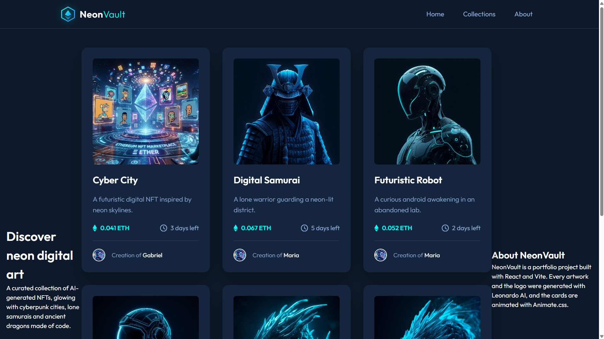
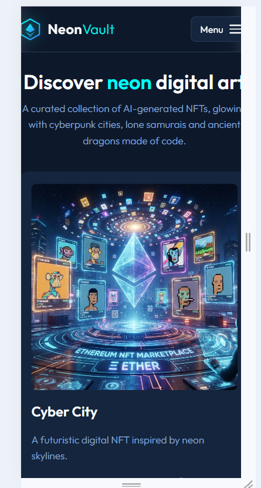
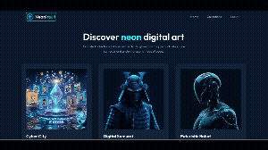

# NeonVault

Coleção responsiva de NFTs gerados por IA, com visual neon, cards animados e interface construída em React.

## Sobre o projeto

O **NeonVault** é um projeto acadêmico de portfólio desenvolvido em grupo. O objetivo é praticar a construção de interfaces com React: componentização (`Header`, `CardList`, `NFTCard`), responsividade, animações e publicação em produção com o GitHub Pages.

A aplicação apresenta uma vitrine de NFTs com título, descrição, preço em ETH, tempo restante e criador. Todas as imagens dos NFTs e a logo foram geradas com inteligência artificial.

## Tecnologias

- React
- JavaScript
- HTML5
- CSS3
- Vite
- Animate.css
- Git
- GitHub
- GitHub Pages
- Leonardo AI

## Funcionalidades

- **NFT cards**: componente `NFTCard` com imagem, título, descrição, preço, tempo restante e criador.
- **CardList**: grade responsiva que renderiza os cards a partir de `src/data/nfts.js`.
- **Imagens geradas por IA**: artes e logo criadas no Leonardo AI.
- **Animações**: entrada dos cards com Animate.css (`fadeInUp`, com atraso escalonado).
- **Hover**: elevação do card, zoom na imagem e overlay com ícone.
- **Header**: logo, navegação (Home, Collections, About) e menu mobile com botão Menu/Close.
- **Design responsivo**: mobile, tablet e desktop.

## Identidade visual

| Item | Definição |
| --- | --- |
| Nome | NeonVault |
| Logo | Hexágono de cofre com losango no estilo do ícone ETH, em degradê ciano → azul (`src/assets/logo.svg`) |
| Tipografia | [Outfit](https://fonts.google.com/specimen/Outfit) (300, 400, 600, 700) |
| Fundo | `hsl(217, 54%, 11%)` |
| Card | `hsl(216, 50%, 16%)` |
| Linhas | `hsl(215, 32%, 27%)` |
| Texto suave | `hsl(215, 51%, 70%)` |
| Destaque | `hsl(178, 100%, 50%)` (ciano neon) |
| Espaçamentos | Múltiplos de 4/8 px (8, 16, 24, 32, 48, 56) |

As cores vêm das variáveis CSS já existentes em `src/index.css`, então o Header combina com os cards sem alterar o trabalho anterior.

## Screenshots

> Adicione as capturas de tela na pasta `docs/` e ajuste os nomes abaixo.

| Desktop | Mobile |
| --- | --- |
|  |  |

## Demonstração
 


## Demo

[https://USUARIO.github.io/NOME-DO-REPOSITORIO/](https://USUARIO.github.io/NOME-DO-REPOSITORIO/)

> Substitua `USUARIO` e `NOME-DO-REPOSITORIO` pelos valores reais depois de publicar.

## Repository

[https://github.com/USUARIO/NOME-DO-REPOSITORIO](https://github.com/USUARIO/NOME-DO-REPOSITORIO)

> Substitua pelo link real do repositório.

## Autores

- Gabriel: NFTCard e estrutura inicial ([perfil no GitHub](https://github.com/USUARIO-GABRIEL))
- Maria: CardList, imagens, animações e responsividade ([perfil no GitHub](https://github.com/USUARIO-MARIA))
- Mayara Meira: Header, identidade visual, README e deploy ([perfil no GitHub](https://github.com/USUARIO-MAYARA))

> Confirme nomes completos e a divisão de tarefas, e troque os links de perfil pelos reais.

## IA

As imagens dos NFTs e a logo do projeto foram geradas com o [Leonardo AI](https://app.leonardo.ai/).

## Animações

A biblioteca [Animate.css](https://animate.style/) é importada em `src/main.jsx`. Cada item do `CardList` recebe as classes `animate__animated animate__fadeInUp` e um `animationDelay` calculado pelo índice (`index * 0.1s`), criando uma entrada em cascata. Os efeitos de hover e o menu mobile usam transições CSS e respeitam `prefers-reduced-motion`.

## Responsividade

A aplicação foi desenvolvida para:

- **Mobile**: Header com botão Menu e painel de navegação, cards em coluna única.
- **Tablet** (a partir de 768 px): navegação inline e cards maiores.
- **Desktop** (a partir de 1024 px): grade de várias colunas, com largura máxima de 1280 px.

## Como executar

```bash
npm install
npm run dev
```

Para gerar a versão de produção:

```bash
npm run build
npm run preview
```

## Publicação no GitHub Pages

O Vite precisa saber que o site fica em uma subpasta (`/nome-do-repositorio/`). Isso é feito pela opção `base` em `vite.config.js`, que por padrão vale `/neonvault/`.

1. Se o repositório tiver outro nome, altere o valor padrão de `base` em `vite.config.js` (ou defina `VITE_BASE=/nome-do-repositorio/` ao rodar o build).
2. Rode `npm run deploy`. O script gera o build e publica a pasta `dist` na branch `gh-pages`.
3. No GitHub, abra **Settings → Pages**, escolha a branch `gh-pages` (pasta `/root`) e salve.
4. O site ficará em `https://USUARIO.github.io/NOME-DO-REPOSITORIO/`.

## Estrutura

```text
src/
├── App.jsx
├── main.jsx
├── components/
│   ├── Header/
│   │   ├── Header.jsx
│   │   └── Header.css
│   ├── CardList/
│   └── NFTCard/
├── data/nfts.js
└── assets/
    ├── logo.svg
    └── images/
```
